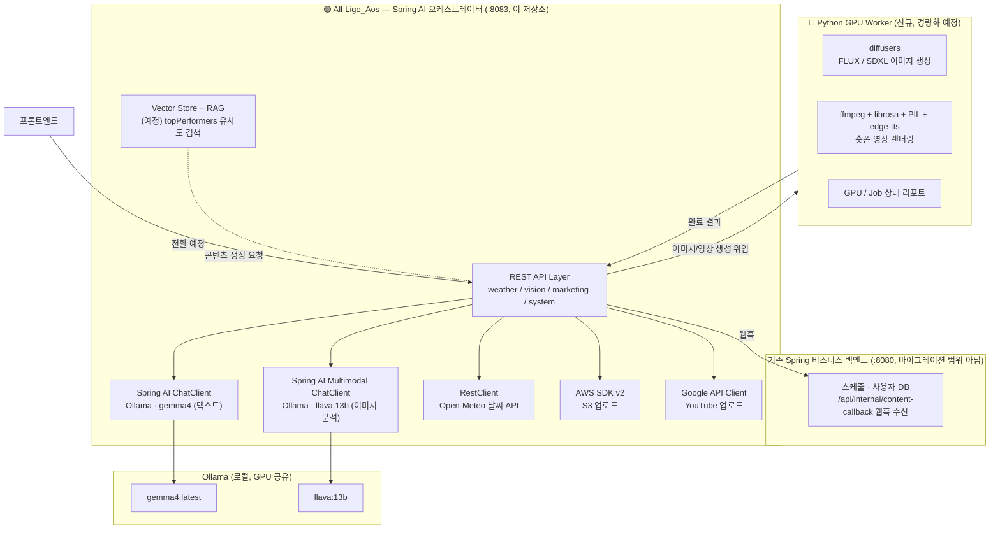

# 📢 All-Ligo AI Marketing Agent — Spring AI Migration (Kotlin)

<p align="center">
  
  
  
  
  
</p>

<p align="center">
  <b>소상공인을 위한 AI 마케팅 콘텐츠 자동 생성 에이전트</b><br/>
  Python/FastAPI로 만들어진 프로토타입을 <b>Kotlin + Spring Boot 4.1 + Spring AI 2.0</b> 기반으로 마이그레이션합니다.
</p>

<p align="center">
  <sub>원래 <a href="https://github.com/YU-Capstone-Design/All-Ligo_ALS">All-Ligo_ALS</a>(Java)로 시작한 마이그레이션을, 진행 초반 단계에서 Kotlin 기반으로 전환하여 이어가는 저장소입니다.</sub>
</p>

---

## 🎯 프로젝트 목표

로컬 GPU 위에서 100% 자체 호스팅되는 AI 모델(Ollama / Gemma / LLaVA / Stable Diffusion)만으로 **마케팅 문구 → 포스터 이미지 → 숏폼 영상**을 자동 생성하던 FastAPI 오케스트레이터를, Spring AI 생태계가 지원하는 범위 안에서 최대한 이관합니다.

> Spring AI가 커버하지 못하는 영역(로컬 이미지 확산 모델, TTS, 오디오 비트 분석 등)은 파이썬 GPU 워커로 남기는 **하이브리드 아키텍처**를 채택했습니다. 이유는 아래 아키텍처 섹션 참고.

---

## 🏗️ 전체 아키텍처



**왜 하이브리드인가?** Spring AI의 `ImageModel`(OpenAI/Azure/StabilityAI만 지원)과 `TextToSpeechModel`(OpenAI/ElevenLabs만 지원)은 로컬 GPU 확산 모델이나 무료 TTS를 지원하지 않습니다. 따라서 이미지·영상 생성 파이프라인은 Python GPU 워커에 남기고, 나머지(텍스트 생성, 비전 분석, 외부 API 연동, 오케스트레이션)는 전부 Spring AI로 이관합니다.

---

## 🛠️ 기술 스택

| 영역 | 기술 |
|---|---|
| 언어 / 런타임 | Kotlin 2.3.21 (JDK 25 툴체인), Gradle Kotlin DSL |
| 프레임워크 | Spring Boot 4.1.0, Spring AI 2.0.0 |
| LLM 서빙 | Ollama (로컬) — `gemma4:latest`(텍스트), `llava:13b`(비전) |
| 외부 연동 | Open-Meteo(날씨), AWS S3(예정), YouTube Data API(예정) |
| 벡터 스토어 / RAG | 검토 중 — pgvector vs Qdrant (예정) |
| GPU 워커 | Python (FastAPI 슬림화), diffusers, ffmpeg, librosa, edge-tts |

---

## 📡 API 현황

| 엔드포인트 | 설명 | 상태 |
|---|---|:---:|
| `GET /api/hello-ai` | Spring AI ChatClient 학습용 테스트 엔드포인트 | ✅ |
| `GET /api/weather` | Open-Meteo 기반 실시간 날씨 조회 | ✅ |
| `POST /api/vision/analyze` | LLaVA 멀티모달 이미지 분석 (objects/mood/colors) | ✅ |
| `GET /api/marketing/generate-text` | 날씨·비전·우수게시물 컨텍스트 기반 블로그용 홍보 텍스트 생성 | ✅ |
| `GET /api/marketing/generate-video-text` | 숏폼 자막 + 이미지 프롬프트 3종 구조화 생성 | ✅ |
| `POST /api/marketing/upload` | 생성된 영상 YouTube 업로드 | ⬜ |
| `GET /api/system/status` | GPU/디스크/동시 작업 상태 조회 | ⬜ |

✅ 완료 · 🚧 진행 중 · ⬜ 예정

> 날씨/비전 실호출 대신 더미 데이터를 사용 중인 임시 구간이 `MarketingTextController`에 `TEMP-TEST` 주석으로 표시되어 있습니다. open-meteo 네트워크 이슈가 해소되면 제거할 예정입니다.

---

## 🗺️ 마이그레이션 로드맵

- [x] **Step 1** — Hello ChatClient (`OllamaChatModel` 연동 검증)
- [x] **Step 2** — 날씨 API (`RestClient`, Spring AI 무관)
- [x] **Step 3** — 비전 분석 (멀티모달 `ChatClient` + `Media`)
- [x] **Step 4** — 텍스트 생성 (`PromptTemplate` + 구조화 출력)
- [ ] **Step 5** — 시스템 상태 + 코루틴/가상 스레드 기반 비동기 처리
- [ ] **Step 6** — Python GPU 워커 슬림화 + REST 계약 정의
- [ ] **Step 7** — 이미지/영상 워커 연동 + S3 업로드
- [ ] **Step 8** — YouTube 업로드 (OAuth2)
- [ ] **Step 9** — 전체 오케스트레이션 + 웹훅 통합
- [ ] **Step 10** — RAG 기반 `topPerformers` 추천 (Vector Store)

> 진행 상황 상세 로그는 별도 관리 문서(옵시디언)에서 추적합니다.

---

## 📂 패키지 구조

기능별로 `record` / `service` / `controller` 서브패키지를 나누는 컨벤션을 사용합니다. Java의 `record`는 Kotlin `data class`로 대응됩니다.

```
com.example.allligo_aos
├── chat/                  # Spring AI 학습용
├── config/                # OpenApiConfig 등
├── weather/
│   ├── record/            # WeatherInfo, OpenMeteoResponse, WeatherCategory (data class)
│   ├── service/           # WeatherService (RestClient)
│   └── controller/
├── vision/
│   ├── record/            # VisionAnalysis (data class)
│   ├── service/           # VisionAnalysisService (멀티모달 ChatClient)
│   └── controller/
└── marketing/
    ├── record/            # MarketingContent (data class)
    ├── service/           # MarketingTextService (PromptTemplate)
    └── controller/
```

> ⚠️ Kotlin은 기본 접근제어자가 `public`이라 Java와 달리 서브패키지 간 타입 참조에 별도 `public` 선언이 필요 없습니다. 다만 Spring AI의 `ChatClient.content()` / `.entity()`처럼 JSpecify `@Nullable`이 붙은 Java API는 Kotlin에서 반환 타입이 `T?`로 강제되므로, Java 레퍼런스 코드를 그대로 옮길 때는 null 처리를 빠뜨리지 않도록 주의해야 합니다.

---

## 🚀 실행 방법

```bash
# 1. Ollama 필요 모델 준비
ollama pull gemma4:latest
ollama pull llava:13b

# 2. 빌드 & 실행
./gradlew bootRun
```

서버는 기본적으로 `:8083`에서 기동됩니다.

---

## 📝 알아둘 점 (설계 노트)

- 로컬 소형/경량 모델(예: `llava:13b`)은 Spring AI의 정식 JSON Schema 구조화 출력(`.entity()`)을 안정적으로 따르지 못하는 경우가 있습니다. 이 경우 원본 파이썬처럼 라벨 텍스트로 응답받아 애플리케이션에서 직접 파싱하는 방식으로 대체했습니다 (`VisionAnalysisService` 참고).
- GPU는 Ollama와 Python 워커가 같은 로컬 머신에서 공유하므로, `keep-alive` 설정과 워커 동시 작업 수 제어가 중요합니다.
- Spring AI는 Kotlin 전용 API 없이 순수 Java 빌더/함수형 인터페이스로 구성되어 있어 Kotlin에서도 문제없이 상호운용됩니다. 다만 JSpecify nullable 애노테이션 때문에 Java에서는 묵시적으로 non-null 취급되던 반환값(`content()`, `entity()`, `MultipartFile.getContentType()` 등)을 Kotlin에서는 매 호출부에서 명시적으로 처리해야 합니다.

---

<p align="center">
  <sub>졸업작품 프로젝트 · Spring AI로 배우는 로컬 LLM 오케스트레이션</sub>
</p>
